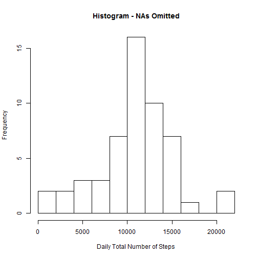
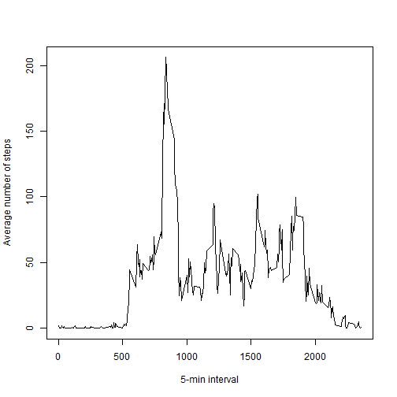
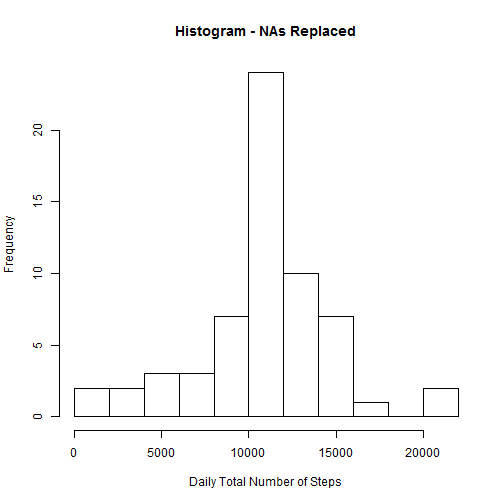
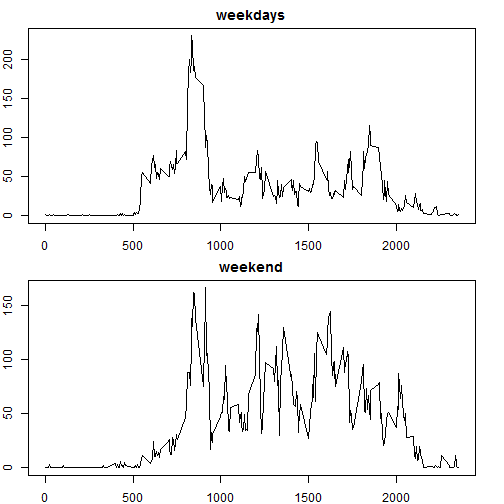

This assignment makes use of data from a personal activity monitoring device. This device collects data at 5 minute intervals through out the day. The data consists of two months of data from an anonymous individual collected during the months of October and November, 2012 and include the number of steps taken in 5 minute intervals each day.  
The zipped file "activity.zip" that contains this information must be in the working directory.

## Loading and preprocessing the data
The following code unzips the file and reads it into a data frame called "data"

```r
unzip("activity.zip")
data<-read.csv("activity.csv")
```

## What is mean total number of steps taken per day?
### Total Steps
The following code calculates the total number of steps taken per day and stores the result in a data frame called "total_steps".  

```r
total_steps<-aggregate(steps~date,data,sum)
head(total_steps)
```

```
##         date steps
## 1 2012-10-02   126
## 2 2012-10-03 11352
## 3 2012-10-04 12116
## 4 2012-10-05 13294
## 5 2012-10-06 15420
## 6 2012-10-07 11015
```
Since missing values were ignored (the aggregate function does this by default) it would be interesting to know which days were omitted:

```r
total_days<-unique(data$date) ## total days
omitted<-total_days[!(total_days %in% total_steps$date)] ## omitted days
```
8 days were omitted: 2012-10-01, 2012-10-08, 2012-11-01, 2012-11-04, 2012-11-09, 2012-11-10, 2012-11-14, 2012-11-30 

### Histogram  
The Histogram of the Daily Total Number of Steps (with omitted NAs) is  

```r
hist(total_steps$steps, breaks=8, xlab="Daily Total Number of Steps",main="Histogram - NAs Omitted")
```

 

### Mean and Median

The mean and median of the total number of steps taken per day are

```r
mean(total_steps$steps)
```

```
## [1] 10766.19
```

```r
median(total_steps$steps)
```

```
## [1] 10765
```


## What is the average daily activity pattern?

### Time series plot


```r
interval<-aggregate(steps~interval,data,mean)
plot(interval$interval,interval$steps,type="l", xlab="5-min interval",ylab="Average number of steps")
```

 

### Interval with maximum number of steps

The 5 minute interval, on average across all the days in the dataset, containing the maximum
number of steps is 


```r
interval$interval[interval$steps==max(interval$steps)]
```

```
## [1] 835
```

## Imputing missing values

### Missing Values

The total number of missing values in the dataset (i.e. the total number of rows
with NAs) is

```r
sum(is.na(data$steps))
```

```
## [1] 2304
```

### Filling Missing Values

The following code replaces missing values for each interval in each day and replaces them with the average steps taken in that interval across all days. The result is stored in a new data frame called "newdata". Then, it calculates the new total number of steps taken per day and stores the result in a data frame called "newtotal_steps" 


```r
colaverage<-rep(interval$steps,61)
newdata<-data
id<-is.na(data$steps)
newdata$steps[id]<-colaverage[id]
newtotal_steps<-aggregate(steps~date,newdata,sum)
head(newtotal_steps)
```

```
##         date    steps
## 1 2012-10-01 10766.19
## 2 2012-10-02   126.00
## 3 2012-10-03 11352.00
## 4 2012-10-04 12116.00
## 5 2012-10-05 13294.00
## 6 2012-10-06 15420.00
```

### Histogram  
The Histogram of the Daily Total Number of Steps (with replaced NAs) is  

```r
hist(newtotal_steps$steps, breaks=8, xlab="Daily Total Number of Steps",main="Histogram - NAs Replaced")
```

 

### Mean and Median

The new mean and median of the total number of steps taken per day are

```r
mean(newtotal_steps$steps)
```

```
## [1] 10766.19
```

```r
median(newtotal_steps$steps)
```

```
## [1] 10766.19
```

We see that the mean does not change, however the median changes slightly and it approaches the mean. This is obvious since we are replacing missing values by the mean.   

## Are there differences in activity patterns between weekdays and weekends?

### weekend/weekday Variable

The following code adds to the data set a new factor variable "day" indicating if the date corresponds to a weekday or a weekend (NOTE: day names are in Spanish because of my operating system)


```r
newdata$date<-as.Date(newdata$date)
dias<-weekdays(newdata$date)
weekend<-c("sábado","domingo")
newdata$day<-as.factor(dias %in% weekend)
levels(newdata$day)[levels(newdata$day)=="TRUE"] <- "weekend"
levels(newdata$day)[levels(newdata$day)=="FALSE"] <- "weekday"
head(newdata)
```

```
##       steps       date interval     day
## 1 1.7169811 2012-10-01        0 weekday
## 2 0.3396226 2012-10-01        5 weekday
## 3 0.1320755 2012-10-01       10 weekday
## 4 0.1509434 2012-10-01       15 weekday
## 5 0.0754717 2012-10-01       20 weekday
## 6 2.0943396 2012-10-01       25 weekday
```

### Panel Plot
The following code plots a panel containing a time series plot of the 5-minute interval (x-axis) and the average number of steps taken, averaged across weekday days or weekend days (the average number of steps is in the y-axis).

```r
datos<-split(newdata,newdata$day)
wdays<-datos[[1]];wend<-datos[[2]]
int_wdays<-aggregate(steps~interval,wdays,mean)
int_wend<-aggregate(steps~interval,wend,mean)
par(mfrow = c(2, 1))
par(mar = c(2, 2, 2, 2))
plot(int_wdays$interval,int_wdays$steps,type="l", main="weekdays")
plot(int_wend$interval,int_wend$steps,type="l", main="weekend")
```

 

The weekdays and weekend patterns are clearly different.
